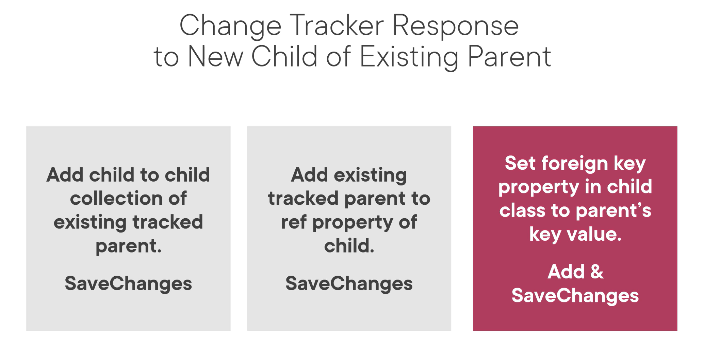

ctrl + shift + p to paste images

 las queries las cachea

## EF.Functions

Piola las functions porque te permiten tirar queries mas cercanas a SQL y usar comodines.

Find es de EF Core, no de LINQ. No podes meterle LINQ despues

Mucho más performante para paginar!

# OJO CON EL ORDENAMIENTO EN LINQ:

# Tracking state y performance.

Se puede poner el noTracking desde la query o por default en el context, después podes forzar a trackear algo desde la query con AsTracking()

# Agregando data

## DebugView para EF
_context.ChangeTracker.DebugView.ShortView/LongView -> ta bueno esto 

# Trabajando con aplicaciones offline

Acá se ve como trae el objeto, lo usa en otro lado y después le dice a EF que actualice en base al objeto q le pasas.

# Migrations

-idempotent se asegura que lo que vayas a agregar no exista

## Para hacer un scaffold de una base ya existente

## Cómo modificar el comportamiento de EF

## 1-to-Many

# Loggin

# Agregar data en relaciones

Cuando hacemos un Include también podemos meterle LINQ a la entidad hija!

OJO con el órden y las mezclas

